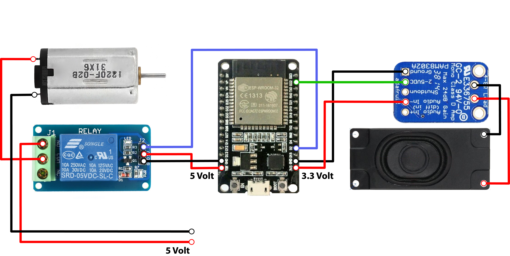

# Feeder

## Funktion
Der ESP verbindet sich über WLAN mit dem Netzwerk "Fossa-Funk" und erwartet über Mqtt Befehle. Durch einen Post in den Channel "feeder/active" mit der Message "true", wird der AudioStream gestartet und über den Lautsprecher ausgegeben. Gleichzeitig wird der Motor mit Strom versorgt wodurch sich die Futterschale zu drehen beginnt. Im Normalfall stoppt der Motor nach einer viertel Drehung, sodass ein neues Futterfach freigegeben wird.

## Aufbau
Der Feeder besteht aus folgenden Komponenten
* [Automatic Pet Feeder](https://www.amazon.co.uk/Obistar-Automatic-Schedule-Personal-Programmable/dp/B01N9MSFNE)
* [ESP32 (Doit Dev Kit v1)](https://www.amazon.de/gp/product/B071JR9WS9/ref=oh_aui_detailpage_o03_s00?ie=UTF8&psc=1)
* [Mono 2.5W Class D Audio Amplifier - PAM8302](https://www.amazon.de/gp/product/B00PY2YSI4/ref=oh_aui_detailpage_o03_s00?ie=UTF8&psc=1)
* [3W 8Ω Lautsprecher](https://www.amazon.de/gp/product/B078WQBDK4/ref=oh_aui_detailpage_o04_s00?ie=UTF8&psc=1)
* [5V Relay](https://www.amazon.de/ARCELI-KY-019-Channel-Module-arduino/dp/B07BVXT1ZK/ref=sr_1_6?s=electronics&ie=UTF8&qid=1531147732&sr=1-6&keywords=relay+module)
* [Powerbank Anker PowerCore 13000mAh](https://www.amazon.co.uk/Anker-PowerCore-13000-Power-Bank/dp/B00Z9UY65G/ref=sr_1_5?s=electronics&ie=UTF8&qid=1531147676&sr=1-5&keywords=anker+power+bank)
* Jumper Wire
* Micro USB Kabel

**Schaltplan**

## Nutzung

### Konfiguration
Wlan SSID und Passwort anpassen
Default: **Fossa-Funk** *miauzgenau*

IP des MQTT TCP Broker anpassen
Default: **192.168.0.150:1883**

### MQTT Befehle

#### Subscribe
| Topic               		| Value    | Description                                                   |
| ------------------------- | -------- | ------------------------------------------------------------- |
| feeder/active     		| bool     | Aktiviert/Deaktiviert Sound und den Motor |
| feeder/playSound    	 	| bool     | Aktiviert/Deaktiviert Sound |
| feeder/stopSound  	   	| false    | Deaktiviert Sound |
| feeder/url				| String   | Url zum AudioStream |
| feeder/startTurning  	  	| bool     | Aktiviert/Deaktiviert Motor |
| feeder/stopTurning  	  	| false    | Deaktiviert Motor |
| feeder/turningTimeActive	| bool	   | Aktiviert/Deaktiviert manuell vorgegebene Motordrehzeiten |
| feeder/turningTime  	 	| int 	   | Motordrehzeit in Millisekunden |
| feeder/isAlive      		| true     | Station gibt ein Lebenszeichen von sich (lockstation#/debug) |
| feeder/restart      		| true     | ESP startet neu |

#### Publish
| Topic                 	| Value    | Description                                                   |
| ------------------------- | -------- | ------------------------------------------------------------- |
| feeder/debug          	| String   | Channel für allgemeine Statusmeldungen |

## To-Do
* OTA Updates auf den ESPs einrichten
* DeepSleep Funktion um Batterie zu sparen
* Lauteren Sound
* Platine in den Feeder integrieren